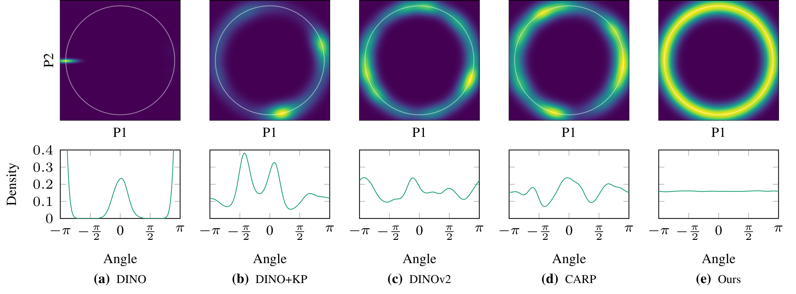
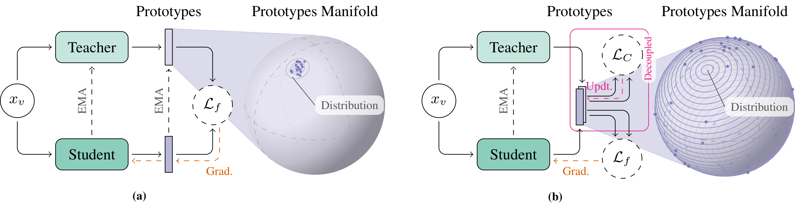

**Figure 1**: *Visualization of prototype distributions for different prototypical SSL methods. Existing methods exhibit pronounced mode collapse, with prototypes concentrating into a small number of regions. In contrast, ours maintains a well-spread and uniform prototype distribution, showing no visible signs of prototypical collapse.*

---


> Note: This is an example of a Jekyll-based project website template: [Github link](https://dsb-ifi.github.io/project-template/).\
> The following content is generated by ChatGPT. The figures were added on the `carousels` setup and placed on the `/assets/images/` folder.

<!-- Information about the carousel: https://talk.jekyllrb.com/t/slider-carousel-in-minimal-theme/6782/3 -->
{% include carousel.html height="50" unit="%" number="1" %}

## Background
Prototypical self-supervised learning (SSL) uses learnable prototypes to define structured targets that guide representation learning. However, many frameworks suffer from a phenomena known as **partial prototype collapse**, where a substantial fraction of the prototypes become redundant, converging to nearly identical representations. A key empirical observation in our study is that this collapse occurs **early** in training. This is problematic as it diminishes target diversity in the SSL objective, which can be especially harmful when training using long-tailed data distributions. A common response is to over-parameterize the prototype set, increasing computation and memory costs, or to add ad-hoc diversity regularizers, at the cost of additional hyperparameters.


## Problem Formulation

Traditional prototypical SSL **jointly** optimizes an encoder $f_\theta$ and a prototype set $C=\{c_k\}_{k=1}^K$ by minimizing a consistency loss over augmented views:
$$
\min_{\theta,\,C}\; \mathcal{L}_f(f_\theta, C).
$$
We argue that this joint objective can induce **shortcut learning**: early in training, prototypes are incentivized to drift toward redundant configurations that reduce $\mathcal{L}_f$ without necessarily improving the overall representations of the the encoder, undermining the purpose of learning $C$.


### Proposed Solution
Instead of optimizing $(\theta, C)$ jointly, we propose to **fully decouple** prototype estimation from encoder learning and alternate two updates at iteration $t$:
**(i) Prototype update**:
$$
C^{t} = \operatorname*{arg\,min}_{C\in\mathcal{C}}\; \mathcal{L}_C\left(C^{t-1}, h^{t}_\phi\right)
$$
We update $C$ via an expectation maximization (EM) procedure **independently** of the encoder's loss.

(ii) **Encoder update:**
$$
\theta^{t+1}=\operatorname*{arg\,min}_{\theta}\;\mathcal{L}_f \left(h^t_\theta, C^{t}\right)
$$
We update the encoder while keeping the prototypes $C^t$ fixed. Our proposed solution is illustrated in the figure below: 

--


**Figure 2:** *(a) Joint optimization of the encoder and prototypes, which can induce shortcut learning and prototype collapse. (b) Our decoupled framework which separates prototype updates from encoder learning, preventing collapse and preserving prototype diversity.*

--

### Results
Across most existing prototypical SSL frameworks, we observe a consistent pattern of **early** partial prototype collapse, where a substantial subset of the prototypes rapidly becomes redundant within the first stages of training. In contrast, our decoupled optimization strategy exhibits **no observable collapse** throughout training. This behavior remains stable even as we progressively **tighten the criterion used to declare collapse**, i.e., adopting increasingly strict notions of prototype redundancy. While our method also yields improved performance on several downstream tasks, the primary finding is its robustness against prototype collapse, highlighting the effectiveness of decoupling prototype estimation from encoder learning.

--


**Figure 3:** *Left: Percentage of unique prototypes versus the collapse threshold $\epsilon$, where larger $\epsilon$ enforces a stricter notion of uniqueness. Existing methods exhibit increasing prototype collapse as the criterion becomes stricter, whereas our proposed decoupled approach shows no collapse across all thresholds. Right: k-NN performance, indicating that preserving prototype diversity can improve downstream performance.*

--
## Citation

```
@inproceedings{
arteaga2026prototypes,
title={Why Prototypes Collapse: Diagnosing and Preventing Partial Collapse in Prototypical Self-Supervised Learning},
author={Arteaga, Gabriel Y. and Aasan, Marius and Chakraborty, Rwiddhi and Hjelkrem-Tan, Martine and Silva, Thalles and Kampffmeyer, Michael and Rivera, Ad{\'\i}n Ram{\'\i}rez},
booktitle={The Fourteenth International Conference on Learning Representations},
year={2026},
url={https://openreview.net/forum?id=fVJEWdwvLO}
}
```
